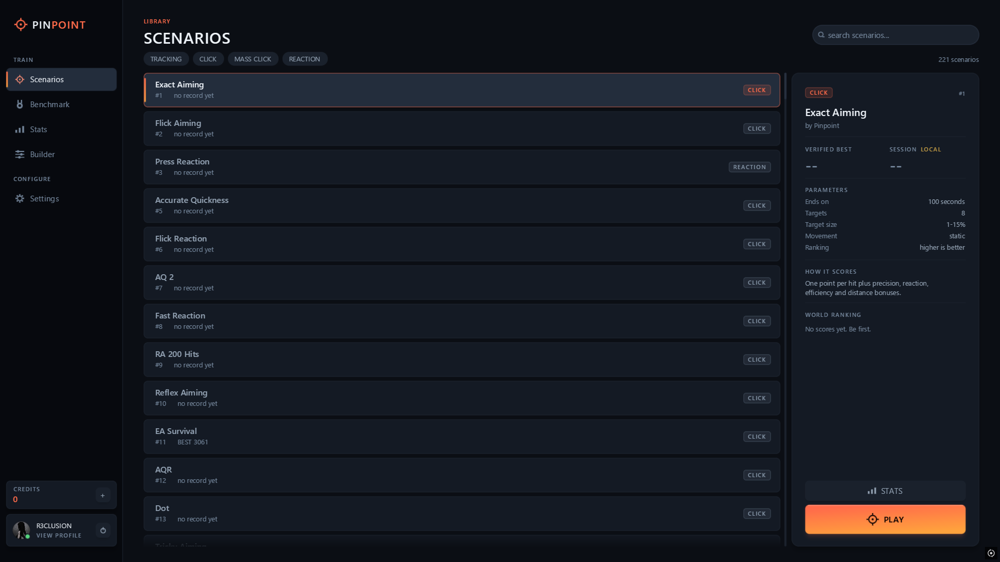
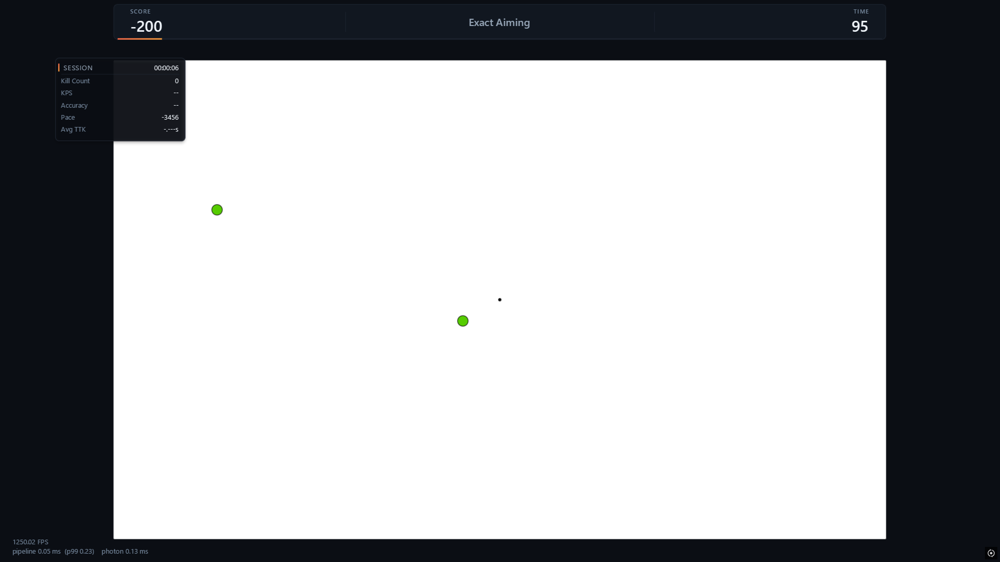
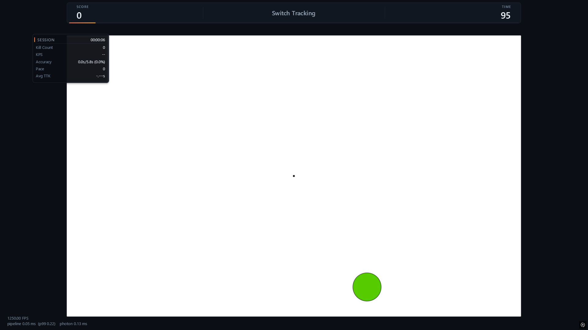
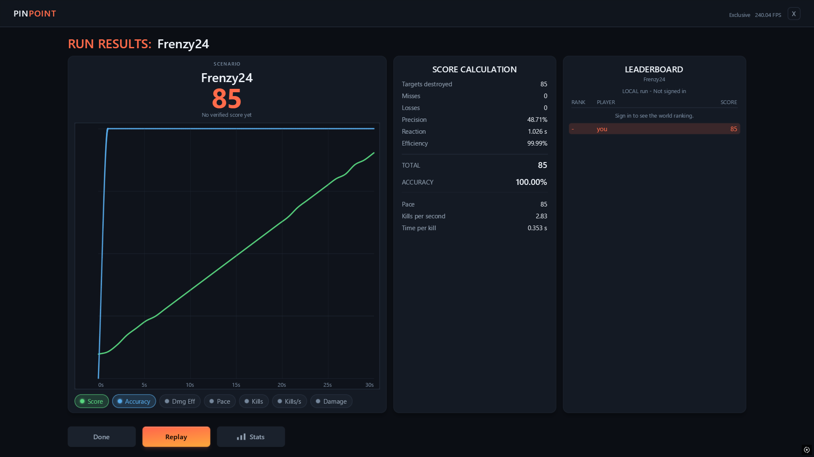
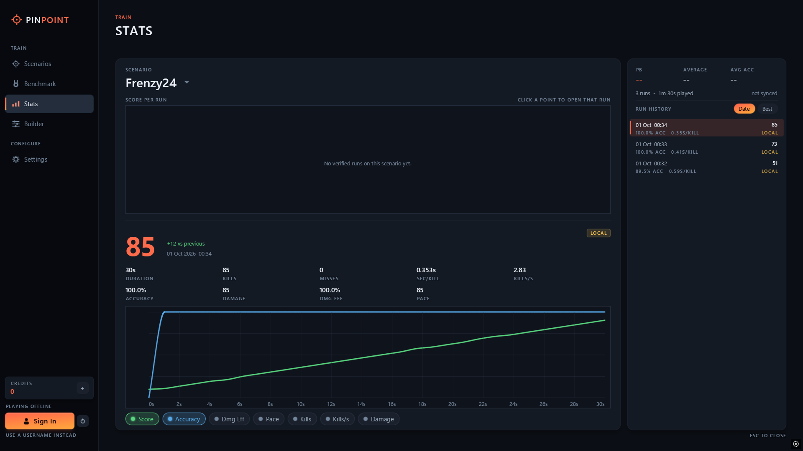
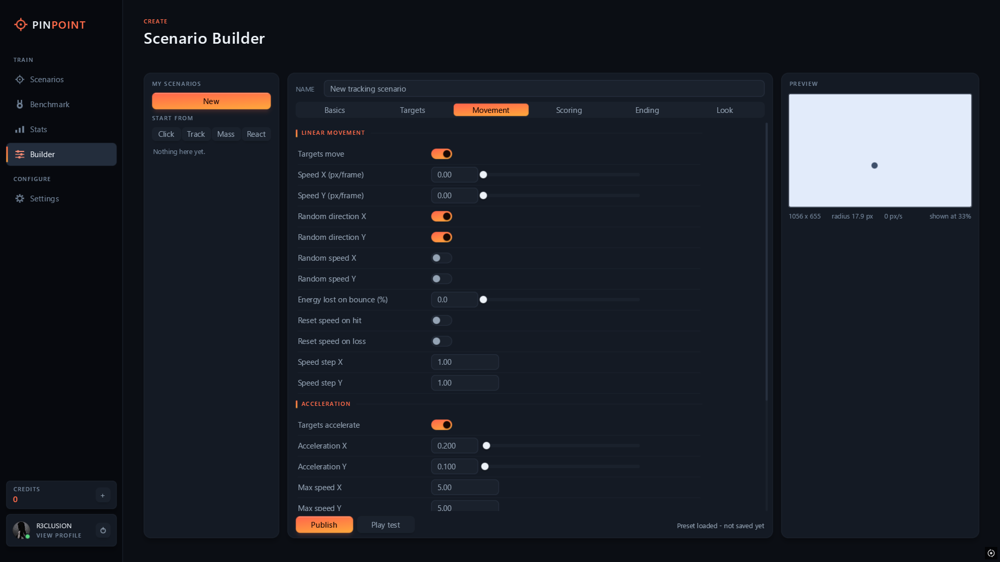
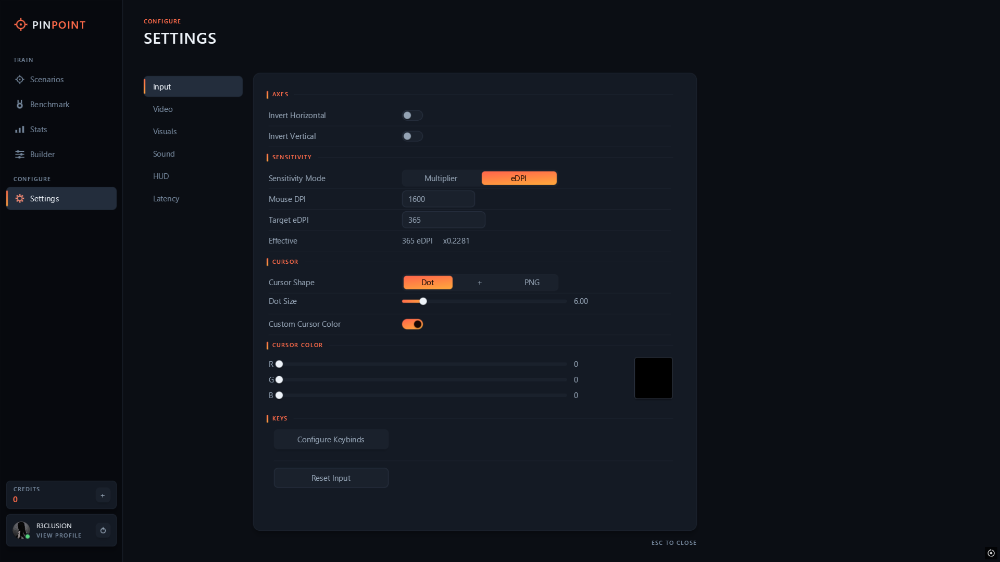
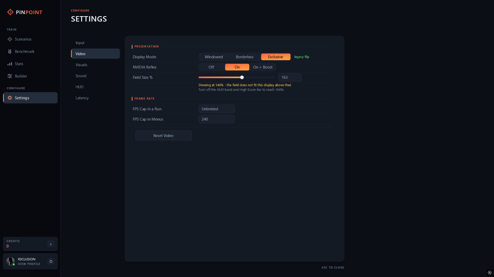
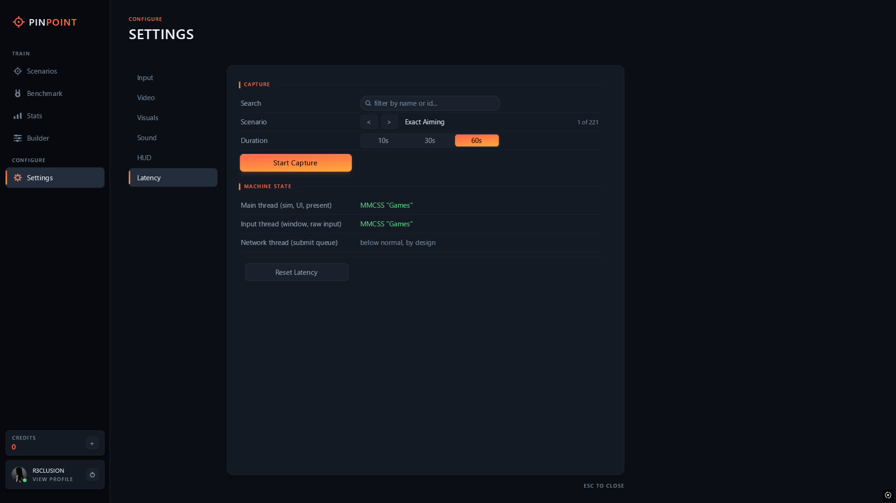

# Pinpoint

A native, low-latency aim trainer for Windows, available on Steam.

Pinpoint is built to strip away everything that is not your aim. There are no game mechanics,
no network jitter and no engine overhead between your hand and the target: just raw mouse input,
a fixed and predictable field, and an uncapped frame rate. Training in that controlled
environment isolates the skill itself, so the precision, speed and consistency you build carry
over to every game you play, 3D or 2D.

**Status:** released on Steam.

## Features

### Training

- **220+ built-in scenarios** across four types: tracking, click, mass click and reaction.
- **Static, moving, strafing, accelerating and shrinking targets**, configured per scenario.
- **Live session panel** in every run: kill count, kills per second, accuracy, pace and average
  time to kill.
- **Search and filter** the library by type or name. Each scenario shows its duration, target
  count, target size, movement, ranking direction and how it scores before you start.

  
  

### Results

Every run ends with a full breakdown: the score curve and accuracy over time, how the score was
calculated (targets, misses, precision, reaction, efficiency), pace and kills per second, and
your place on the scenario's leaderboard.

### Scores you can trust

- **Server-verified leaderboards.** The server issues the random seed for each run, the client
  records the inputs, and the server replays them through the same simulation code to compute the
  score. The number your client shows is never what gets ranked.
- **Verified and local are always labelled.** Personal bests, averages and trend lines count
  verified runs only. Anything else is marked LOCAL.
- **Offline play works.** Signing in is only needed for leaderboards.

### Benchmark and ranks

- Three sections (Beginner, Intermediate, Advanced), each with 18 scenarios split across
  Clicking, Tracking and Switching, and three subcategories per category.
- Each scenario earns energy toward an overall rank. Ranks only count verified runs.
- Thresholds come from the server, so balance changes never need an update.

### Stats

- Score history per scenario with personal best, average and accuracy.
- Per-run curves for score, accuracy, pace, kills and kills per second.
- Click any point in the history to open that run.

### Scenario builder

Build your own scenarios from a click, tracking, mass click or reaction template. Every setting
is editable: targets, size, movement, acceleration, bounce, scoring, ending conditions and
colours. A live preview updates as you edit, and you can play test before publishing.

### Settings

| Area | Options |
|---|---|
| Input | Raw input always on. Sensitivity as a multiplier or as a target eDPI. Invert axes. Rebindable keys. |
| Cursor | Dot, cross or custom PNG. Size and colour. |
| Video | Exclusive fullscreen, borderless or windowed. NVIDIA Reflex Off, On or On + Boost. Separate frame caps for runs and menus. Adjustable field size. |
| Visuals | Light and dark themes, plus custom themes you can save and share. |
| HUD | Choose which stats show during a run. |
| Sound | Hit sounds and volume. |
| Latency | A built-in latency capture and a readout of the thread scheduling state. |

  
  

## Performance

Pinpoint is engineered for the lowest possible input-to-photon latency.

- **Native C++ with Direct3D 11.** No game engine, no browser, no garbage collector in the frame
  loop.
- **A dedicated input thread** reads raw mouse input, separate from the render thread. Both are
  registered with the Windows multimedia scheduler for game priority.
- **Exclusive fullscreen** takes the Windows compositor out of the display path. Borderless and
  windowed use tearing-enabled flip presentation with a waitable swap chain, so input is sampled
  as late as possible before each frame.
- **No allocations on the run path**, so frame-time spikes never come from the heap.
- **The game logic runs at a fixed 62.5 Hz tick**, independent of frame rate, so a score means the
  same thing on every machine. Rendering and input run as fast as the hardware allows.

The in-run overlay shows live frame rate and pipeline time, and Settings > Latency measures the
full pipeline on your own machine.

## How to install

1. Buy and install Pinpoint from Steam.
2. Launch it from your Steam library.

### Requirements

- Windows 10 or 11, 64-bit.
- A DirectX 11 capable GPU.
- NVIDIA Reflex options appear on supported NVIDIA GPUs.

## How to use

1. Launch Pinpoint and sign in with Steam to enable leaderboards and benchmark ranks.
2. Open **Settings**:
   - **Input:** set your mouse DPI and sensitivity. eDPI mode matches the cursor speed you are
     used to.
   - **Video:** choose exclusive fullscreen for the lowest latency, and turn on NVIDIA Reflex if
     your GPU supports it.
   - **Cursor** and **HUD:** pick the crosshair and the stats you want on screen.
3. Open **Scenarios**, pick one from the library (or start with the Beginner benchmark to find
   your level), and press **Play**.
4. Review the results screen after each run, and track your progress over time in **Stats**.

Escape ends a run early without recording it.

## Built with

C++20, Win32, Direct3D 11 and NVIDIA Reflex. Scores are verified server-side by the same
simulation code compiled to WebAssembly.

## License

Proprietary. All rights reserved.
